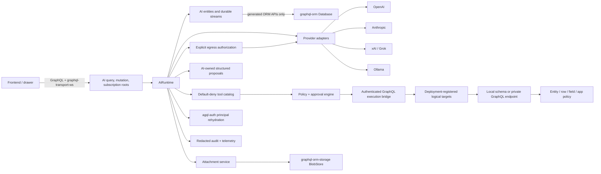

# `graphql-orm-ai` Architecture and Implementation Plan

## Summary

Implement `graphql-orm-ai` as a project-agnostic Rust agent runtime built around:

- Durable per-user chat sessions and background runs.
- Efficient, cursor-windowed GraphQL history and resumable subscriptions.
- Provider-neutral model adapters for OpenAI, Anthropic, xAI/Grok, Ollama, and local/OpenAI-compatible endpoints.
- Secure tool execution through the application's existing authenticated GraphQL schema.
- An AI-owned structured-proposal workflow that lets early deployments stage suggested changes without mutating application records.
- Discovery of all generated resolvers plus explicit registration of handwritten application resolvers.
- Default-deny tool exposure, risk-based approvals, current-user reauthorization, and data-egress policy.
- Explicit authorization for each external data transfer; ordinary read permission never implies permission to disclose data to a model, built-in tool, or MCP server.
- GraphQL-managed runtime configuration, provider profiles, tool policies, skills, retention, budgets, and content-protection policy.
- Attachment storage through `graphql-orm-storage`.
- Backup integration through `graphql-orm-backup`.
- Authentication, principal rehydration, delegation, recent-MFA, and long-lived connection security through `agql-auth`.
- The same `graphql-orm` database selected by the host application, with no sidecar database and no raw SQL outside `graphql-orm`.

This planning document records the requested Digitise investigation. No crate source, public API, schema name, example, fixture, or runtime behavior may depend on or reference Digitise.

The package name and existing folder spelling will be `graphql-orm-ai`; prompt spellings such as `grapqhl-orm-ai` and `graphql-orm-stroage` are treated as typos.

## Locked Decisions

- Tool exposure is default-deny.
- Resolver discovery does not itself authorize model use.
- Enabled tools are always constrained by the current user's ordinary GraphQL authorization.
- Risk-based approval is mandatory:
  - Read-only tools may run without per-call approval after policy enablement.
  - Low-risk, idempotent writes may be policy-approved.
  - Publish, delete, permission changes, credential changes, external sending, destructive operations, and other high-impact actions always require one-shot approval.
- The first production consumer pilot is read-only with respect to application data. Its only write-capable agent action is creating a validated proposal in AI-owned staging tables.
- A human applies accepted proposal fields through the application's ordinary mutation path. Direct application mutation tools remain in the full implementation scope, but are enabled only after a separate write-maturity security gate and use one-shot approval for high-impact actions.
- GraphQL read authorization and external data-egress authorization are independent checks. Both must allow a value before it can leave the application trust boundary.
- Provider credentials support centrally managed profiles plus optional per-user BYOK.
- Session deletion purges content while retaining only redacted, non-content security audit facts.
- Navigation support is limited to typed, validated UI intents; frontend routing and drawer implementation stay application-owned.
- Runtime state uses the host's configured `graphql-orm` backend.
- SQLite, PostgreSQL, and eventually MSSQL are supported without raw SQL in `graphql-orm-ai`.
- Full MSSQL writes, migrations, transactions, and security parity will be implemented in `graphql-orm`; no hidden SQLite/PostgreSQL sidecar is allowed for MSSQL applications.
- Content protection is configured per application, tenant, or project scope before AI is enabled:
  - `DatabaseManaged`: rely on database/volume encryption for conversational content.
  - `FieldEncrypted`: encrypt conversational content through first-class `graphql-orm` encrypted fields.
  - Provider credentials are always field-encrypted or stored in an external secret store regardless of scope policy.
- Delivery is phased. SQLite/PostgreSQL production support and OpenAI land before every provider and advanced protocol are complete.
- Every leased run uses a monotonically increasing fencing token. A worker that loses its lease cannot append events, save tool/provider results, or finalize the run.
- Restore is a runtime lifecycle state, not just row import. Workers, subscriptions, and provider callbacks remain closed until post-restore reconciliation succeeds.
- Local database tests must never connect to a live PostgreSQL or MSSQL instance. Containers are mandatory.
- The runtime supports both embedded/local schemas and separately deployed GraphQL services. Federation products and router brands are host concerns; the reusable boundary is a target-bound authenticated GraphQL executor.
- A model never chooses a GraphQL URL, schema, subgraph, delegation audience, or execution target. Tools bind to deployment-registered logical targets and exact schema/document/projection fingerprints.
- Tool-result disclosure is derived from server-owned field/projection metadata. Runtime classification may only raise classification, redact, or remove data; it cannot make statically forbidden data exportable.
- Provider calls require an atomically reserved budget proof. Estimated capacity is reserved before egress and actual usage is reconciled exactly once afterward.
- Approvals bind to the complete server-generated action envelope, including target resources and versions, policy and schema versions, actor/delegation identity, and a canonical preview.
- GraphQL resolver, argument, and field naming is a compile-time integration choice. Camel case is the default; PascalCase and other supported conventions must not require aliases or consumer-specific roots.
- Local execution is a first-class deployment option. HTTP model servers
  (Ollama/OpenAI-compatible) use provider adapters; installed agent/model
  harnesses use a separate allowlisted process/ACP driver. Neither path grants
  shell, filesystem, network, credential, or application-tool authority by
  implication.
- Public API, GraphQL contract, feature, or schema changes follow SemVer and must update `CHANGELOG.md` and `MIGRATION.md` under the repository release rules.

## Repository Investigation

### `graphql-orm`

The current runtime is version 0.6.1 and already provides much of the required foundation:

- Managed SQLite and PostgreSQL writes and migrations.
- Entity, field, row, relation, repository, and GraphQL surface policies.
- `AuthSubject` and `DbAuthContext`.
- State-machine transactions.
- Versioned compare-and-swap.
- Append-only entities.
- Composite forward keyset pagination.
- Backup metadata and a transactional change journal.
- Generated queries, mutations, and subscriptions.
- Composition of generated and handwritten GraphQL roots.

Relevant foundations are documented in `../../graphql-orm/docs/portable-persistence.md` and `../../graphql-orm/docs/strict-authorization.md`.

Required gaps:

1. No stable resolver-operation registry covering generated operations.
2. No bidirectional `before`/`last` keyset connection for chat history.
3. Generated subscriptions are in-memory broadcast streams rather than durable replayable streams.
4. Generated subscription filter arguments are currently unused, and events are not row-policy filtered per subscriber.
5. Long-lived subscriptions do not periodically rehydrate and reauthorize their principal.
6. MSSQL is intentionally read/query-only.
7. Existing field transforms are insufficient as a full encrypted-field contract: they lack keyring lifecycle, rotation, repository-path support, backup semantics, and search/filter restrictions.
8. No provider-neutral vector storage/search contract.
9. Schema modules cannot currently contribute migration-only entities without exposing generated CRUD roots.
10. Some backup/restore and durable queue primitives still force sibling crates toward raw SQL.

### `graphql-orm-storage`

The existing 0.5.0 design is the correct attachment boundary:

- Provider-neutral `BlobStore`.
- Streaming reads and writes.
- Range reads.
- Conditional writes and copy.
- Local, S3, and SMB providers.
- No unsafe default GraphQL upload/download resolvers.

Its explicit decision that authorization and GraphQL routes remain application-owned should be preserved. See `../../graphql-orm-storage/docs/architecture.md` and `../../graphql-orm-storage/docs/blob-store.md`.

No major redesign is required for the AI core. The AI crate should wrap `BlobStore` with attachment ownership, quarantine, validation, scanning, and lifecycle metadata.

### `graphql-orm-backup`

The current 0.4.0 crate has:

- Full logical backup and restore.
- Blob-backed repositories.
- Object checksum verification and deduplication.
- Incremental backup orchestration and manifest support.

Gaps affecting AI:

- The ORM adapter still reports incremental export/restore as unsupported even though `graphql-orm` now has a change journal.
- The ORM adapter contains direct SQL for table counts, clearing restore targets, truncation, and SQLite foreign-key handling.
- The object index assumes one metadata table, while AI attachments and application objects may occupy multiple tables.
- AI secret, encrypted-content, raw-provider-payload, and retention policies need explicit backup rules.

### `agql-auth`

Version 0.8.0 already provides:

- `AuthPrincipal` for user sessions and API/service tokens.
- Scopes, roles, tenant metadata, resource binding, token IDs, session IDs, actor data, and correlation IDs.
- Recent-MFA/session-assurance primitives.
- Token status checking.
- Fail-closed `ReauthorizationPolicy`.
- Audience-bound resource-server validation.
- Structured, redacted authorization decisions.

The long-lived connection documentation currently leaves the actual timer/status/close loop to each host. See `../../agql-auth/docs/websocket-reauthorization.md`.

Required additions are principal references, current-principal rehydration, reusable transport reauthorization, and bounded delegation support.

### Digitise reference-consumer audit

The audited consumer currently contains:

- `FileMetadata`, `FileAnalysisRun`, and `FileTextSegment`.
- `AgentSession`, `AgentMessage`, `AgentTask`, and `AgentUsageEntry`.
- A direct OpenAI Responses HTTP integration.
- Encrypted AI settings scoped by application, collection, or user.
- An unbounded in-process queue plus database task rows.
- Startup recovery of queued/running work.
- Structured image analysis and metadata extraction.
- Admin-only AI mutations.

Important findings:

- The `AgentSession`, `AgentMessage`, `AgentTask`, and `AgentUsageEntry` types are not included in the composed `schema_roots!` entity list, despite documentation implying they are exposed.
- The scheduler uses an unbounded channel and has no durable lease/heartbeat/dead-letter model.
- The model integration is OpenAI-specific.
- The agent path frequently uses repository access rather than the authenticated GraphQL resolver path.
- Existing repository authorization is broad enough to become a privilege bypass if reused for user-delegated tools.
- AI policies are too coarse for per-user sessions.
- There are no AI session subscriptions or bounded history windows.
- Generated entity subscriptions are currently unsuitable for security-sensitive agent watches.
- Provider settings and encryption are useful prototypes but should move behind generic provider-profile and secret-store contracts.
- Application-specific catalog/file-analysis entities should remain in the application. Orchestration, providers, sessions, tool calls, attachments, usage, approvals, and common structured-analysis execution should move to `graphql-orm-ai`.

The current implementation is primarily in:

- `../../digitse/src/ai/manager.rs`
- `../../digitse/src/ai/file_analysis.rs`
- `../../digitse/src/domain/entities/ai.rs`
- `../../digitse/docs/engineering/ai-delivery-plan.md`
- `../../digitse/docs/engineering/ai-agent-manager-plan.md`
- `../../digitse/docs/product/ai-assisted-cataloging-and-ingest-workspace.md`

### Digitise agent review of this plan

A subsequent review by the Digitise agent agreed with the overall scope but identified six contracts that must be stronger before implementation:

1. AI schema/table ownership must be explicit rather than inferred from composition.
2. Internal tool execution must share authorization, request-context, rate-limit, and application-audit behavior with ordinary GraphQL execution.
3. Permission to read data must not automatically authorize external model/tool egress.
4. Worker leases need fencing, not expiry/heartbeat alone.
5. Restore must reconcile uncertain runtime/external state before any worker resumes.
6. Digitise should be used earlier, initially with read-only tools and structured suggestions that a human applies through normal mutations.

This revision adopts all six. It retains the full long-term direct-mutation and multi-step-agent scope, but separates capability design from rollout authority: the early pilot is `ProposalOnly`, supervised mutations come after a distinct security gate, and high-impact actions remain one-shot approved.

### Federated and independently deployed consumer review

A later review from an independently deployed, federated consumer validated the existing default-deny, egress, reauthorization, fencing, restore, and proposal-only decisions. It also exposed reusable gaps that apply beyond any one router, service topology, or product domain. This plan adopts the following project-agnostic changes:

1. Treat federation as remote authenticated GraphQL execution, not as a federation-specific runtime mode.
2. Support logical local and remote execution targets with immutable deployment registration, audience/resource binding, schema fingerprints, and short-lived delegation.
3. Prevent recursion structurally: application tools cannot invoke AI control-plane roots, introspection, configuration, approval, or tool-discovery operations.
4. Replace arbitrary post-hoc JSON classification with a server-owned disclosure schema bound to the tool projection. Unknown and non-exportable fields fail closed.
5. Reserve budget atomically before every provider call and reconcile actual usage afterward so concurrent runs cannot overspend the same remaining allowance.
6. Bind approvals to resource versions, policy state, delegated actor, target/schema/document fingerprints, and a server-generated canonical action preview.
7. Add compile-time GraphQL naming features so a host can consistently select camelCase, PascalCase, or another supported convention without aliases.
8. Add reusable conformance tests for local/remote authorization parity, destination enforcement, token non-persistence, recursion denial, disclosure denial, and concurrent budget reservations.

The review's deployment recommendations remain host-owned. This crate does not mandate a standalone service, separate database, particular router, provider, tenant rollout, or domain proposal type. It supports both embedded and standalone operation while preserving the same security contracts.

## External Architecture Research

### T3 Code

The current [T3 Code repository](https://github.com/pingdotgg/t3code) was inspected as an architectural reference.

Useful patterns to adopt:

- Append-oriented orchestration events with sequence, stream version, command, causation, correlation, and actor metadata.
- Provider-driver isolation and capability discovery.
- Queue-backed workers and runtime receipts.
- Normalized provider events.
- Explicit approval records.
- Projection tables for fast UI reads.
- Push events with sequence-based resume.
- Virtualized message rendering and scroll-anchor preservation.

A limitation not to copy:

- T3 currently returns complete thread message/activity snapshots in important paths. DOM virtualization helps rendering, but does not bound backend query cost, network transfer, or client memory. `graphql-orm-ai` must provide server-side message and content-block windows.

### Provider APIs

Provider tool semantics are not uniform:

- OpenAI Responses exposes custom functions, streaming event types, web search, file search, image generation, code execution, MCP, and background processing. The design should follow the native [tools](https://developers.openai.com/api/docs/guides/tools), [streaming](https://developers.openai.com/api/docs/guides/streaming-responses), [conversation state](https://developers.openai.com/api/docs/guides/conversation-state), and [webhook](https://developers.openai.com/api/docs/guides/webhooks) contracts.
- Anthropic distinguishes application-executed tools from server tools and requires the application to drive the client-tool loop. Its current contract is documented in [How tool use works](https://platform.claude.com/docs/en/agents-and-tools/tool-use/how-tool-use-works).
- xAI supports server tools and client function calls through its Responses-style APIs, including parallel calls. See [xAI Tools](https://docs.x.ai/developers/tools/overview).
- Ollama supports native streaming tool calls and partial OpenAI compatibility. See [Ollama tool calling](https://docs.ollama.com/capabilities/tool-calling) and [OpenAI compatibility](https://docs.ollama.com/api/openai-compatibility).

Therefore:

- Implement an internal provider-neutral event and capability SPI.
- Use native adapters for the four required providers.
- Do not make a third-party framework part of the public API.
- Rig was evaluated because it supports many providers, tools, streaming, RAG, and MCP in Rust ([Rig](https://rig.rs/)). It will not be the core abstraction because provider built-ins, event reconciliation, background runs, security policy, and audit behavior must remain under this crate's control. An optional internal Rig adapter may be considered later.

### Security and standards

- Tool schemas use JSON Schema 2020-12.
- History connections follow the [Relay Cursor Connections specification](https://relay.dev/graphql/connections.htm).
- Agent threats are modeled against OWASP's prompt-injection, sensitive-disclosure, and excessive-agency risks. The 2025 excessive-agency guidance identifies excessive functionality, permissions, and autonomy as distinct root causes ([OWASP](https://owasp.org/www-project-top-10-for-large-language-model-applications/2_0_vulns/LLM06_ExcessiveAgency.html)).
- Telemetry follows OpenTelemetry GenAI naming, while content, tool arguments, and tool results remain redacted by default because the conventions identify them as sensitive ([OpenTelemetry](https://opentelemetry.io/docs/specs/semconv/registry/attributes/gen-ai/)).
- MCP support targets specification `2025-11-25`. Streamable HTTP requires origin validation, authentication, and secure resumption ([MCP transports](https://modelcontextprotocol.io/specification/2025-11-25/basic/transports)); authorization uses OAuth resource/audience binding ([MCP authorization](https://modelcontextprotocol.io/specification/2025-11-25/basic/authorization)).
- ACP is suitable as an optional installed-agent boundary, not as the internal
  application-agent protocol. Its established local topology is a JSON-RPC
  subprocess over stdio; the standard also assumes a trusted coding agent that
  may receive editor-mediated file and MCP access, which this server runtime
  must not inherit automatically ([ACP introduction](https://agentclientprotocol.com/get-started/introduction),
  [ACP architecture](https://agentclientprotocol.com/get-started/architecture)).
  Remote ACP transports remain a separate evolving concern. Stable
  `session/close` capability can be used to release per-session resources when
  supported ([ACP session close](https://agentclientprotocol.com/announcements/session-close-stabilized)).

## System Boundary

`graphql-orm-ai` is not primarily an MCP server. It is an application agent runtime that may execute in-process or as a separately deployed GraphQL service, with optional MCP client/server adapters.



Core rules:

- The model never receives a general SQL, repository, shell, or arbitrary GraphQL execution tool.
- User-delegated application work executes through server-authored GraphQL documents against the already-built host schema.
- Each tool call uses a freshly rehydrated principal and the exact same request-context construction path the ordinary client resolver receives.
- The host resolver's normal authorization and audit run unchanged. AI orchestration adds an outer audit record linked by correlation, causation, run, and tool-call IDs; it does not replace the application audit or invent a second actor.
- Data crossing to a provider, provider built-in, remote MCP server, web destination, or other external processor requires a separate egress decision over the exact outbound manifest.
- `SystemAccess` and trusted repository surfaces are prohibited for model-requested application tools.
- Internal AI persistence may use generated repository methods because it is the runtime's own data, not an application capability granted to the model.
- Logical target IDs are server-owned and resolve through immutable deployment registration. GraphQL configuration may disable or narrow a target but cannot add arbitrary destinations or relax its audience/resource boundary.
- A remote executor mints or obtains short-lived delegated authority immediately before the request. It never stores or forwards the user's original bearer token.
- Direct-service execution is a separately capped target class and may not grant more authority than the ordinary routed path. Hosts prove parity through conformance tests.

## Schema and Workflow Ownership

Ownership must be unambiguous so applications cannot accidentally fork AI persistence or bypass lifecycle rules:

| Owner | Responsibilities |
|---|---|
| `graphql-orm-ai` | AI entity definitions, reserved table namespace, schema-module ID/version/fingerprint, migrations, indexes, backup descriptors, restore hooks, proposal storage, retention rules, and runtime reconciliation. |
| `graphql-orm` | Portable schema-module composition, database-specific migration syntax, schema introspection, transactions, leases, durable streams, and restore primitives. |
| Host application | Domain entities and resolvers, application policies, request-context construction, scope mapping, proposal type registrations, proposal review UI, and the normal domain mutation used to apply an accepted proposal. |
| `agql-auth` | Principal identity, rehydration, session/token status, assurance, delegation, and long-lived authorization contracts. |

Rules:

- Reserve the `graphql_orm_ai_*` table namespace for this crate. The host must not reproduce, rename, or manually migrate these tables.
- Publish a stable schema-module ID plus semantic module version and descriptor fingerprint. Startup compares compiled metadata with the managed schema and fails closed on unknown ownership, incompatible versions, or drift.
- Applications extend behavior through typed registries (`AiToolDescriptor`, `AiProposalTypeDescriptor`, access/egress policy, and UI intents), not by modifying AI-owned entities.
- Application-specific staged data may remain application-owned, but the generic proposal envelope and lifecycle are AI-owned. The boundary is explicit in its descriptor.
- The application owns the final domain write. A generic AI mutation never applies an application proposal to a domain record.
- Backup and restore discover AI state through the schema module. The host must not maintain a second list of AI tables.

## Crate Structure

Begin as one published crate with feature-gated modules. Do not split provider crates until compile time or dependency pressure justifies it.

```text
graphql-orm-ai/
├── Cargo.toml
├── src/
│   ├── lib.rs
│   ├── runtime/
│   ├── provider/
│   │   ├── openai.rs
│   │   ├── anthropic.rs
│   │   ├── xai.rs
│   │   ├── ollama.rs
│   │   └── openai_compatible.rs
│   ├── persistence/
│   ├── graphql/
│   ├── tools/
│   ├── approvals/
│   ├── security/
│   ├── attachments/
│   ├── skills/
│   ├── context/
│   ├── telemetry/
│   ├── mcp/
│   └── acp/
├── tests/
└── docs/
    └── plan.md
```

Feature flags:

- Backends: `sqlite`, `postgres`, `mssql`; exactly one AI persistence backend per runtime instance.
- Providers: `provider-openai`, `provider-anthropic`, `provider-xai`, `provider-ollama`, `provider-openai-compatible`.
- Integrations: `auth-agql`, `storage`, `backup`, `mcp-client`, `mcp-server`, `acp`.
- Transport/security: `rustls`.
- Advanced: `embeddings`, `vector-search`, `image-generation`, `audio`.

A host that enables multiple `graphql-orm` backends may still select exactly one primary AI persistence backend. AI entity definitions should be generated behind explicit backend modules so Cargo feature unification does not make the derives ambiguous.

## Public Rust Interfaces

### Runtime construction

```rust
pub struct AiRuntime<B: WriteBackend> { /* private */ }

pub struct AiRuntimeBuilder<B: WriteBackend> { /* private */ }

impl<B: WriteBackend> AiRuntimeBuilder<B> {
    pub fn database(self, database: Database<B>) -> Self;
    pub fn principal_resolver(
        self,
        resolver: Arc<dyn CurrentPrincipalResolver>,
    ) -> Self;
    pub fn graphql_executor(
        self,
        executor: Arc<dyn AuthenticatedGraphqlExecutor>,
    ) -> Self;
    pub fn egress_policy(self, policy: Arc<dyn AiEgressPolicy>) -> Self;
    pub fn access_policy(self, policy: Arc<dyn AiAccessPolicy>) -> Self;
    pub fn secret_store(self, store: Arc<dyn AiSecretStore>) -> Self;
    pub fn blob_store(self, store: Arc<dyn BlobStore>) -> Self;
    pub fn audit_sink(self, sink: Arc<dyn AiAuditSink>) -> Self;
    pub fn build(self) -> Result<(AiRuntime<B>, GraphqlExecutorBinding), AiError>;
}
```

Schema construction is two-stage to avoid cyclic ownership:

1. Build the runtime with an unbound one-time executor slot.
2. Add `AiRuntime` to schema data and compose AI roots.
3. Finish the application schema.
4. Bind a clone of the finished schema to `GraphqlExecutorBinding`.
5. Verify the AI schema-module identity/version/fingerprint and runtime start gate.
6. Start workers, subscriptions, and webhook processing only after binding and any restore reconciliation succeed.

Startup fails closed if any enabled tool document cannot validate against the composed schema.

### Provider SPI

```rust
pub trait AiProvider: Send + Sync {
    fn provider_kind(&self) -> ProviderKind;
    fn capabilities(&self) -> ProviderCapabilities;

    fn stream(
        &self,
        request: ModelRequest,
        context: ProviderRequestContext,
    ) -> ProviderEventStream;

    async fn embed(
        &self,
        request: EmbeddingRequest,
    ) -> Result<EmbeddingResponse, ProviderError>;

    async fn generate_image(
        &self,
        request: ImageGenerationRequest,
    ) -> Result<ImageGenerationResponse, ProviderError>;
}
```

`ProviderCapabilities` includes:

- Text and multimodal input/output.
- Streaming.
- Custom tools and parallel tool calls.
- Structured output.
- Embeddings.
- Image generation.
- Audio/transcription.
- Provider web search, file search, code execution, and MCP.
- Prompt caching.
- Background mode/webhooks.
- Local execution.
- Maximum context/output/file constraints.

`ProviderEvent` is exhaustive for known normalized semantics and includes an `Unknown` variant so new provider events do not crash streams:

- `ResponseStarted`
- `TextDelta`
- `ReasoningSummaryDelta`
- `ToolCallStarted`
- `ToolArgumentsDelta`
- `ToolCallCompleted`
- `BuiltinToolStarted`
- `BuiltinToolCompleted`
- `Citation`
- `Usage`
- `ResponseCompleted`
- `Error`
- `Unknown`

Hidden chain-of-thought is never persisted. Only provider-supported reasoning summaries may be retained.

### Authenticated application execution and audit parity

The bridge must use the host's canonical request-envelope factory. A host must not manually reconstruct a reduced approximation of its HTTP/WS context for AI calls.

```rust
pub trait GraphqlRequestContextFactory: Send + Sync {
    async fn build(
        &self,
        principal: &ResolvedPrincipal,
        invocation: &GraphqlInvocationContext,
    ) -> Result<GraphqlRequestContext, ToolExecutionError>;
}
```

The factory is the same implementation used by ordinary GraphQL transports and supplies identity, authorization, rate-limit, loader, request, and audit context. `GraphqlInvocationContext` identifies the mechanism as an AI tool call but preserves the rehydrated user/delegated principal as the actor.

```rust
pub trait AuthenticatedGraphqlExecutor: Send + Sync {
    async fn execute(
        &self,
        principal: &ResolvedPrincipal,
        request: ToolGraphqlRequest,
    ) -> Result<ToolGraphqlResponse, ToolExecutionError>;

    fn execute_stream(
        &self,
        principal: ResolvedPrincipal,
        request: ToolGraphqlRequest,
    ) -> ToolGraphqlResponseStream;
}
```

The host implementation must inject its normal:

- `AuthPrincipal`
- `AuthUser` or API-token principal
- `AuthSubject`
- `DbAuthContext`
- Request/correlation context
- Application state
- Loaders and policy data
- Rate-limit and application audit context

`ToolGraphqlRequest` contains a server-authored operation document, operation name, validated variables, tool-call ID, idempotency key, and correlation metadata. It never accepts a model-authored GraphQL document.

Execution parity requirements:

- The same principal and variables presented through the normal client and tool bridge produce the same allow/deny decision and domain result.
- The ordinary resolver audit remains authoritative for the domain operation.
- The outer AI audit records the run/tool mechanism and points to the application audit using correlation and causation IDs.
- The actor is the user or bounded delegation, never a fictional unrestricted "AI user". The run/tool call is recorded as the mechanism.
- Request context creation, rate limits, transaction behavior, policy data, and loader visibility cannot differ merely because the caller is an AI tool.
- Tests compare ordinary transport and tool-bridge decisions, outputs, and audit facts for the same operation.

The same contract supports local and remote execution. A remote implementation adds a deployment-registered `GraphqlExecutionTarget` and a target-bound, ephemeral authority envelope. The public target contains only a logical ID, transport/trust class, audience/resource binding, and schema fingerprint; provider-facing tools and model context never receive a URL or credential.

Every non-internal descriptor binds:

- Logical execution-target ID.
- Target schema fingerprint/version.
- Server-authored operation-document hash and operation name.
- Server-owned result-projection and disclosure-schema fingerprints.
- Operation ownership/domain (`Application`, proposal staging, or forbidden AI control plane).

Registration parses and rejects introspection and recursively reachable AI control-plane operations. Execution rejects target, schema, document, operation, or projection drift before constructing delegated authority. Remote authority is non-serializable, redacted in `Debug`, audience/resource/purpose bound, short-lived, and minted immediately before transport execution. Correlation, causation, human actor, delegation reference, rate-limit identity, and application audit context cross the boundary.

Router/subgraph topology remains opaque to this crate. A host may register a private federated router, a private service, or a local schema under the same interface. Direct-service targets are disabled by default and must pass the same or narrower authorization contract as the routed target.

### Application access policy

```rust
pub trait AiAccessPolicy: Send + Sync {
    async fn can_access_session(
        &self,
        principal: &AuthPrincipal,
        session: &AiSessionRef,
        action: AiSessionAction,
    ) -> AiDecision;

    async fn can_use_provider_profile(
        &self,
        principal: &AuthPrincipal,
        scope: &AiScope,
        profile: &AiProviderProfileRef,
    ) -> AiDecision;

}
```

Application access policy decides whether data may be read or acted upon. It does not assign a permissive classification to arbitrary output JSON. Tool-result disclosure is controlled by the static projection contract below; runtime policy may only narrow that contract.

### External data-egress policy

```rust
pub trait AiEgressPolicy: Send + Sync {
    async fn authorize(
        &self,
        principal: &ResolvedPrincipal,
        manifest: &AiEgressManifest,
    ) -> AiEgressDecision;
}
```

`AiEgressManifest` describes the exact proposed transfer without embedding plaintext content:

- Provider profile, provider kind, model, endpoint trust class, and destination/tool.
- Capability (`model_inference`, web search, image analysis/generation, provider file search, remote MCP, or other external processing).
- Session/scope, source message/block/attachment/tool-artifact references, and their data classifications.
- Approximate byte/token counts, attachment MIME/count, residency/retention characteristics, and purpose.
- Manifest hash, policy versions, current principal reference, and any required consent/approval reference.

The decision is the intersection of deployment hard boundaries, scope policy, provider profile, current authorization, data-classification rules, and purpose-bound user consent where required. Deployment network policy cannot be relaxed through GraphQL. Secret and credential classifications are never eligible for egress. The decision and manifest hash are audited without content; a changed manifest invalidates a prior decision or approval.

### Secret storage

```rust
pub trait AiSecretStore: Send + Sync {
    async fn put(
        &self,
        scope: &AiScope,
        purpose: SecretPurpose,
        value: SecretBytes,
    ) -> Result<SecretRef, SecretError>;

    async fn resolve(
        &self,
        reference: &SecretRef,
    ) -> Result<SecretGuard, SecretError>;

    async fn rotate(
        &self,
        reference: &SecretRef,
        value: SecretBytes,
    ) -> Result<SecretRef, SecretError>;

    async fn delete(
        &self,
        reference: &SecretRef,
    ) -> Result<(), SecretError>;
}
```

Provide:

- `OrmEncryptedSecretStore`
- `EnvironmentSecretStore` for read-only bootstrap
- An adapter contract for external KMS/Vault systems

No public response returns secret values.

Mutable credential stores must support safe compensating rotation semantics.
Creating a credential without an existing reference allocates a fresh,
unguessable reference; it never silently overwrites another secret. The
configuration service writes that reference, its CAS update, a redacted audit
fact, and any cleanup command in one ORM transaction. If the transaction fails,
the fresh secret is deleted as compensation. After commit, the old reference is
deleted; a failed delete remains as a durable `AiSecretCleanup` command for a
bounded retry worker. External stores should also expire unreferenced fresh
values so loss of both database and compensating cleanup cannot create an
indefinite orphan. Secret plaintext and secret references never appear in the
GraphQL response, audit payload, model context, telemetry, or ordinary backup.

## Persistent Data Model

All tables are defined as `graphql-orm` entities and migrated through schema metadata. No migration or query in this crate may contain SQL.

| Entity | Purpose and key fields |
|---|---|
| `AiProviderProfile` | Scope, provider kind, display name, base URL or logical deployment-owned local-harness reference, credential reference, enabled state, data policy, limits, version. GraphQL never stores a harness executable or arbitrary arguments. |
| `AiModelRoute` | Scope, task kind, priority, profile/model, fallbacks, model parameters, capability requirements, budget. |
| `AiScopePolicy` | AI enabled state, maximum tool maturity, allowed capabilities, proposal limits, runtime budgets, and version. It can only narrow deployment hard caps. |
| `AiContentProtectionPolicy` | Scope, selected protection mode, key policy/version, effective date, migration state. AI remains disabled for the scope until this exists. |
| `AiEgressPolicy` | Scope, destinations/providers/capabilities, classification ceiling, consent rule, residency/retention limits, enabled state, version. Deployment hard boundaries remain outside and always intersect this row. |
| `AiEgressConsent` | Purpose-bound principal/scope/destination consent, manifest constraints, grant/expiry/revocation, assurance, and version. Contains no transferred content. |
| `AiToolPolicy` | Scope, stable tool ID/fingerprint, enabled flag, constraints, risk override, approval rule, call/output limits. |
| `AiRetentionPolicy` | Scope, delta/raw-payload/audit/content retention and deletion behavior. |
| `AiBudgetCounter` | One policy/time-window counter with atomically reserved, committed, and released token/cost/run units plus CAS version. |
| `AiBudgetReservation` | Exact run/attempt/provider/model/pricing binding, reserved estimates, actual reconciliation, expiry, fencing generation, and reserved/committed/released/uncertain state. |
| `AiSession` | Owner, tenant/scope, title, state, active run, last activity, stream head/version, archive/delete timestamps. |
| `AiSessionParticipant` | Future-compatible owner/editor/viewer membership. Version one exposes owner-only sessions but stores ownership through this shape. |
| `AiSessionEvent` | Durable per-session sequence, type, event ID, run/causation/correlation IDs, protected payload, timestamp. |
| `AiInboxEvent` | Durable per-principal sequence for cross-session completions, approvals, errors, and drawer updates. |
| `AiMessage` | Session, stable order sequence, role, author, run, provider/model, block count, preview, completion status, timestamps. |
| `AiMessageBlock` | Message, block index, protected text/structured content, byte/line counts. Maximum uncompressed block size: 32 KiB. |
| `AiAttachment` | Owner/session/message, opaque blob reference, safe filename, declared/detected MIME, size, SHA-256, scan/processing state. |
| `AiAttachmentArtifact` | Thumbnail, OCR, extracted text, transcript, derivative, or provider-file reference. |
| `AiRun` | Session/input message, requested principal reference, provider route, durable state, attempt ID, lease owner, monotonically increasing lease generation/fencing token, lease expiry/heartbeat, retry, cancellation, error, usage, CAS version. |
| `AiRunAttempt` | Immutable attempt/generation history, claim/finish times, provider response references, recovery classification, and redacted outcome. Supports fencing audit and uncertain-side-effect recovery. |
| `AiRunStep` | Ordered provider/tool/approval/context step with timing and state. |
| `AiToolCall` | Tool ID/fingerprint, protected arguments/result, argument hash, risk, auth decision, approval, idempotency, status. |
| `AiApproval` | Tool call, complete action-binding hash, target/schema/document/projection fingerprints, protected canonical preview, resource/version preconditions, safe policy/auth-state versions, principal/delegation actor, decision, approver, expiry, MFA requirement, one-shot consumption, and CAS version. |
| `AiProposal` | AI-owned staging envelope: session/run/scope, proposal type/schema ID and version, protected structured payload, status, source references, creator, reviewer, expiry, applied outcome links, and CAS version. It never directly mutates an application record. |
| `AiProposalItem` | Optional bounded field/operation item for review, with stable path, suggested protected value, rationale/source references, review decision, and ordering. |
| `AiContextCheckpoint` | Summary through a session sequence, source hash, token estimate, provider/model, protected text. |
| `AiSkill` | Scope, name, description, enabled/current version. |
| `AiSkillVersion` | Immutable instructions, allowed tools, data policy, activation rule, schemas, budgets, provenance, checksum. |
| `AiUsageEntry` | Append-oriented provider/model usage, token/cache/tool/image units, calculated cost, session/run/scope. |
| `AiProviderWebhookReceipt` | Provider event ID, signature verification result, received/processed state for idempotency. |
| `AiEgressEvent` | Redacted manifest hash, provider/destination/capability, classifications, policy/consent versions, byte/token estimates, decision, reason, principal, run, and timestamp. No plaintext content. |
| `AiAuditEvent` | Redacted non-content action, actor, resource, allow/deny, reason code, correlation, timestamp. |
| `AiSecretCleanup` | Durable, redacted cleanup command for an obsolete or compensating secret reference, retry state, timing, and CAS version. It is never exposed through generic CRUD or model tools. |
| `AiRuntimeRecovery` | Restore/recovery epoch, module version/fingerprint, start-gate state, dry-run/applied status, redacted issue/action counts, operator, and timestamps. Detailed sensitive diagnostics remain protected. |

Indexes must include:

- Sessions by owner/scope/state and `(last_activity_at DESC, id DESC)`.
- Messages by `(session_id, sequence)`.
- Message blocks by `(message_id, block_index)`.
- Events by `(session_id, sequence)` and inbox events by `(principal_ref, sequence)`.
- Runs by `(status, next_attempt_at, priority, id)`.
- Lease expiry.
- Pending approvals by principal/session/status.
- Pending proposals by scope/session/status and `(created_at DESC, id DESC)`.
- Tool calls by run and idempotency key.
- Attachments by session/message/hash.
- Usage by scope/time/provider/model.
- Egress events by scope/principal/time and manifest hash.

Conversational entities must be purgeable, so database-enforced append-only triggers are used only for redacted audit and usage records. Runtime code treats finalized messages and event rows as immutable but allows authorized retention purges.

## GraphQL API

The crate exports `AiQueryRoot`, `AiMutationRoot`, and `AiSubscriptionRoot` for composition through `schema_roots!`.

### Queries

- `aiSessions(filter, page)`
  Returns session shells only.

- `aiSession(id)`
  Returns metadata and current run state, never the complete history.

- `aiMessages(sessionId, page)`
  Bidirectional keyset connection ordered by session sequence.

- `aiMessageBlocks(messageId, page)`
  Fetches bounded blocks only for visible/expanded messages.

- `aiSessionEventPage(sessionId, afterSequence, first)`
  Durable catch-up page with a watermark and `hasMore`.

- `aiInboxEventPage(afterSequence, first)`
  Cross-session catch-up for drawers and notifications.

- `aiRun(id)`
- `aiPendingApprovals(sessionId)`
- `aiProposals(filter, page)`
- `aiProposal(id)`
- `aiAttachments(sessionId, page)`
- `aiSkills(scope, page)`
- `aiAvailableModels(scope)`
- `aiUsage(scope, interval, page)`
- `aiToolCatalog(scope, query, page)`
  Returns only metadata the caller may know about.
- Administrative, redacted provider/configuration queries.
- Administrative, redacted egress-policy and egress-decision queries.

### Mutations

Session lifecycle:

- `createAiSession`
- `renameAiSession`
- `archiveAiSession`
- `restoreAiSession`
- `deleteAiSession`
- `sendAiMessage`
- `retryAiRun`
- `resumeAiRun`
- `cancelAiRun`
- `submitAiFeedback`

Approval lifecycle:

- `approveAiToolCall`
- `denyAiToolCall`
- `revokeAiApproval`

Proposal lifecycle:

- `reviewAiProposal` records per-item accept/reject/edit intent but does not write domain data.
- `rejectAiProposal`
- `expireAiProposal`

Proposal creation is an internal, schema-validated runtime service/tool, not an unrestricted public mutation. Applying a proposal is deliberately absent. The application exposes its ordinary domain mutation and, after a successful domain transaction, calls `AiProposalService::record_outcome` from trusted server code with the resulting resource and application-audit references. Clients cannot forge an applied outcome.

Attachments:

- `createAiAttachmentUpload`
- `finalizeAiAttachmentUpload`
- `removeAiAttachment`

Configuration:

- `upsertAiProviderProfile`
- `setAiProviderCredential`
- `rotateAiProviderCredential`
- `removeAiProviderCredential`
- `testAiProviderProfile`
- `upsertAiModelRoute`
- `upsertAiScopePolicy`
- `upsertAiToolPolicy`
- `upsertAiEgressPolicy`
- `grantAiEgressConsent`
- `revokeAiEgressConsent`
- `setAiContentProtectionPolicy`
- `setAiRetentionPolicy`
- `setAiBudget`
- `createAiSkill`
- `createAiSkillVersion`
- `publishAiSkillVersion`
- `disableAiSkill`

Every configuration mutation uses compare-and-swap versions, emits a redacted audit event, and requires the relevant administrative capability. Credential, high-impact tool policy, content-protection, and break-glass changes require recent MFA by default.

### Subscriptions

- `aiSessionEvents(sessionId, afterSequence)`
- `aiInboxEvents(afterSequence)`

Subscription behavior:

1. Authenticate connection init.
2. Rehydrate and authorize the principal.
3. Read durable events after the supplied sequence to a captured watermark.
4. Attach to the live bounded wakeup stream.
5. Re-read the durable table whenever awakened; the broadcast payload is never the source of truth.
6. Deduplicate by event ID/sequence.
7. Detect retention gaps.
8. Emit `RESET_REQUIRED` when the requested sequence is no longer available.
9. Periodically reauthorize through `agql-auth`.
10. Close or pause on revocation, expiry, permission removal, session deletion, or scope loss.

### Pagination defaults

- Initial message page: `last: 50`.
- Maximum message page: 200.
- Older history: `last: 50, before: startCursor`.
- Event replay default: 100.
- Event replay maximum: 500.
- Content block maximum: 100 blocks.
- `totalCount` is opt-in and off by default.

Message nodes contain:

- A bounded preview, at most 4 KiB.
- Block count and attachment metadata.
- No unbounded nested content collection.

This keeps database reads, network payloads, browser memory, and the DOM independently bounded.

## Resolver Discovery and Tool Catalog

### Generated resolvers

`graphql-orm` will emit stable `ResolverOperationDescriptor` records for every generated query, mutation, and subscription.

Each descriptor contains:

- Stable operation ID.
- Schema coordinate and GraphQL field name.
- Operation kind.
- Entity and relation metadata.
- Description.
- Argument names and JSON Schema.
- GraphQL input/output type names.
- Server-generated operation document template.
- Default safe scalar projection.
- Auth mode and policy keys.
- Generated/read/write/bulk/destructive annotations.
- Maximum safe page/output defaults.
- Descriptor fingerprint.

The runtime imports every descriptor but exposes none by default.

### Handwritten application resolvers

Applications register custom resolvers explicitly:

```rust
AiToolCatalog::builder()
    .graphql(
        AiGraphqlTool::new(
            "example.publish",
            OperationKind::Mutation,
            include_str!("graphql/publish.graphql"),
            json_schema_for!(PublishVariables),
        )
        .risk(ToolRisk::HighImpact)
        .approval(ApprovalRule::Always)
        .result_projection(ResultProjection::json_pointer("/publish")),
    );
```

Requirements:

- Static server-owned GraphQL document.
- Explicit variable schema.
- Explicit result projection.
- Stable ID and risk.
- Output byte/record limits.
- Optional idempotency contract.
- Optional scope/input constraints.
- Startup validation against the composed schema.

Schema or document fingerprint changes disable the persisted tool policy until an administrator reviews and re-enables it.

Application mutation tools additionally declare a maturity class:

- `ReadOnly`: no application state change.
- `ProposalOnly`: may write only a validated AI-owned proposal envelope.
- `SupervisedWrite`: may invoke an explicitly registered application mutation under approval policy.
- `AutonomousWrite`: reserved for a future narrowly proven workflow and disabled by default.

The deployment and per-scope policy set a maximum maturity. The first reference-consumer pilot is hard-capped at `ProposalOnly`; configuration in GraphQL cannot raise it above the deployment cap.

### Structured proposal registry

Applications register project-specific suggestions without teaching the shared crate their domain:

```rust
AiProposalCatalog::builder().register(
    AiProposalTypeDescriptor::new(
        "example.record-metadata.v1",
        json_schema_for!(RecordMetadataSuggestion),
    )
    .display_metadata(/* labels and field hints, no routes */)
    .required_source_kinds([SourceKind::ResolverResult, SourceKind::Attachment])
    .max_items(100),
);
```

The internal `emit_proposal` tool validates the model output against the registered schema, enforces scope and size limits, protects the payload, records source provenance, and writes only the AI staging tables. The host UI lets a person review/edit fields. Accepted values are then submitted through the normal application mutation as that person. This gives the pilot useful write-like assistance without granting the model domain write authority.

### Tool discovery

Large schemas must not send hundreds of tool definitions in every provider request.

Implement a provider-neutral `discover_tools` function that:

- Searches only enabled tools visible in the session scope.
- Returns concise descriptors.
- Loads full schemas only for selected tools.
- Supports namespaces and skill allowlists.
- Never reveals secret/admin-only operations to ordinary users.

Provider-native deferred tool search may optimize this, but the local catalog remains authoritative.

### Safe projections

Generated tools never grant the model control of arbitrary GraphQL selections.

- Generated entity projections include readable, non-private scalar fields.
- Sensitive fields require explicit projection policy.
- Relations require separately registered tools or bounded projections.
- Query page sizes are capped.
- Results are limited to 64 KiB model-facing output by default.
- Larger results are summarized or stored as a protected tool artifact and returned by opaque reference.
- GraphQL errors are normalized to safe codes without raw database/provider details.

### Static disclosure schemas

Every application tool must register a server-owned disclosure schema for its exact result projection before it can be enabled. The schema describes the output shape recursively and assigns each object, list, and scalar field:

- A minimum `DataClassification`.
- `Exportable` or `NeverExport` disposition.
- Bounded list/item limits where applicable.
- Stable schema version and fingerprint.

Tool registration binds the operation document, target schema, result projection, and disclosure schema into the descriptor fingerprint. Result evaluation fails closed on unknown fields, unexpected shapes, oversized lists, fingerprint drift, or any selected `NeverExport` node. Secret and credential fields must be excluded from server-authored GraphQL projections; a runtime redactor is defense in depth, not the primary boundary.

Application runtime policy may raise a classification, remove fields, or replace values with redacted markers. It cannot lower the static classification, admit unknown fields, or change `NeverExport` to exportable. Egress manifests use the effective maximum classification and preserve per-source provenance.

`graphql-orm` should expose generic field/projection disclosure metadata so generated resolvers can produce these schemas. Until that metadata lands, hosts may register reviewed descriptors manually. Generated metadata remains discovery, never automatic AI exposure.

### Atomic budget reservation

Before any provider bytes leave the process, the runtime resolves every applicable deployment, scope, tenant, principal, session, skill, and route budget and reserves the estimated run/input/output/tool/image/cost units in one ORM transaction.

- Reservations bind run, attempt, lease generation, provider kind, model, pricing-policy version, and an idempotency key.
- All applicable counters are checked and incremented atomically; partial reservation is rolled back.
- A provider call requires an opaque reservation proof matching the exact run/provider/model and requested output ceiling.
- Actual provider usage is appended and all counters are reconciled in the same transaction exactly once. Unused capacity is released.
- Missing usage settles conservatively at the reserved ceiling unless a provider-status reconciliation proves otherwise.
- Abandoned reservations expire only when no external call can still complete. Uncertain calls remain reserved for fenced recovery rather than being released optimistically.
- Fallback routes require a new reservation when model, provider, price, or output limits change.

Concurrent runs therefore cannot independently pass a stale remaining-budget check.

## Authorization and Approval Flow

Every application tool call follows this sequence:

1. Validate provider tool arguments against JSON Schema.
2. Resolve the stable tool descriptor and exact fingerprint.
3. Confirm the exact registered fingerprint has an enabled scope-policy
   binding; catalog discovery alone never enables it.
4. Apply input constraints and data-classification rules.
5. Rehydrate the current principal from its non-secret reference.
6. Check token/session status and current assurance.
7. Invoke a fresh principal-, scope-, descriptor-, and validated-argument-aware host tool authorization policy and record its current policy version plus safe authorization-state digest. Catalog presence alone can never satisfy this step.
8. Enforce the deployment/scope tool-maturity cap. A `ProposalOnly` deployment rejects every application mutation descriptor even if an administrator accidentally enables it.
9. Evaluate approval policy.
10. If approval is needed, persist a request bound to:
   - Tool-call ID.
   - Canonical argument hash.
   - Tool fingerprint.
   - Logical execution target, target schema fingerprint, operation-document hash, operation name, result projection, and disclosure-schema fingerprint.
   - Principal reference, delegated actor/grant reference, session, scope, and tenant/resource boundary.
   - Every target resource reference plus expected row version, ETag, or precondition digest.
   - Tool/scope/application authorization policy versions and a safe authorization-state digest that contains no role/scope snapshot.
   - Server-generated canonical action preview and preview hash.
   - Expiry.
   - One-shot maximum use count.
11. After approval, rehydrate and reauthorize again, rebuild the canonical preview, and recheck all policy/resource/schema preconditions. Any mismatch expires the approval and requires a new one.
12. Build the GraphQL request through the host's canonical request-context factory.
13. Execute the server-owned GraphQL request.
14. Let the normal resolver, entity, row, field, application, rate-limit, and audit policies decide access exactly as for a client call.
15. Validate serialized size, record/list bounds, closed result shape, and every static disclosure rule before returning data to orchestration. Unknown or `NeverExport` fields fail closed.
16. Apply any runtime classification tightening/redaction and persist only the protected bounded result locally.
17. Build an outbound egress manifest for whatever portion would be returned to the provider, then independently authorize that transfer.
18. Audit application execution and AI orchestration as linked records, plus the allow/deny egress decision.
19. Return only the egress-authorized normalized result to the model.

Approval defaults:

| Risk | Default |
|---|---|
| Read-only internal | No per-call approval after explicit policy enablement. |
| AI-owned structured proposal | May be enabled in a `ProposalOnly` deployment; schema validation, provenance, limits, and human review remain mandatory. It grants no domain write permission. |
| Low-risk idempotent write | May be allowed by an explicit administrator policy. |
| Non-idempotent write | Per-call approval unless specifically proven safe. |
| Publish/external send | Always one-shot approval. |
| Delete/destructive | Always one-shot approval. |
| Permission/membership change | Always approval and recent MFA. |
| Credential/secret operation | Never model-callable by default; administrator UI only. |
| Arbitrary code/shell/computer | Disabled; future sandbox-only support. |
| External MCP tool | Approval determined by server trust, tool risk, and egress classification; default deny. |

Approvals expire after five minutes by default and cannot be reused with changed arguments.

The canonical action preview is created by a server-owned preview provider or dry-run resolver and contains typed targets, fields/diffs, impact class, and preconditions. Model-written prose is never the approved artifact. Approval authorizes only the exact preview; it does not grant resolver permission or preserve a stale role/scope decision.

### Explicit egress authorization flow

Read authorization answers whether the principal may use data inside the application. Egress authorization separately answers whether identified data may be disclosed to an identified external processor for an identified purpose.

Before every provider request, provider built-in, remote web/file/image/code/MCP call, and tool result returned to a remote model:

1. Assemble the exact candidate payload locally.
2. Classify every source and preserve provenance/trust markers.
3. Construct and hash the redacted `AiEgressManifest`.
4. Rehydrate the current principal.
5. Intersect deployment network/region boundaries, scope egress policy, provider profile policy, current access, classification ceiling, purpose, retention/residency constraints, and any required consent.
6. If policy requires one-shot consent or recent MFA, pause before any bytes leave the process and bind the grant to the manifest hash.
7. Recompute immediately before transmission. Any changed source, destination, model, capability, attachment, classification, or size invalidates the decision.
8. Persist a redacted allow/deny event and transmit only after allow.

Provider-side web search is both model egress and a provider built-in capability; enabling general chat does not implicitly enable it. Remote MCP, provider file retention, image analysis, and code execution have independent capability switches. Local Ollama can have a different destination trust class, but still passes policy. Credentials, encryption keys, raw authentication artifacts, and values classified `Secret` are always denied.

## Authentication and Background Delegation

Never persist bearer tokens or stale role/scope snapshots.

Persist only an `agql-auth` principal reference containing safe identifiers such as:

- Principal kind.
- Subject.
- Session or API-token ID.
- Session family.
- Tenant/resource binding.
- Actor reference.
- Expiry metadata.
- Correlation reference.

Interactive runs:

- Require an active user session.
- Pause as `REAUTH_REQUIRED` when the session expires or is revoked.
- Resume only after the user reauthenticates.

Background runs:

- Continue across browser disconnects.
- Still stop when the underlying session/delegation is revoked or loses access.
- Long-running delegated work receives a bounded delegation grant containing a maximum expiry, allowed AI scope, tool set, and cost budget.
- The grant never adds scopes the user did not possess.
- Scheduled/system work uses an audience- and resource-bound service principal, not a borrowed user token.

The principal is rehydrated:

- Before provider egress.
- Before each tool call.
- After each approval.
- At periodic long-run checkpoints.
- On subscription reauthorization deadlines.

## Provider Profiles and Model Routing

Provider routing consumes an atomic budget reservation in addition to the existing egress proof. GraphQL-managed pricing and budget policy is versioned and can only narrow deployment ceilings. Deployment-owned provider destinations, credentials, and network capability remain immutable hard boundaries and cannot be introduced through a profile mutation.

Configuration hierarchy:

1. Application default.
2. Tenant/project scope.
3. User profile/BYOK, when enabled.

Resolution always applies the most specific allowed profile without crossing tenant boundaries.

Each model route declares:

- Task kind.
- Required capabilities.
- Preferred provider/model.
- Ordered fallbacks.
- Maximum input/output.
- Tool/built-in policy.
- Data-classification ceiling.
- Cost/rate budget.
- Residency/storage requirements.

Fallback is allowed only when:

- Capability requirements still match.
- Data policy permits the destination provider.
- The user has access to that profile.
- BYOK policy permits fallback.
- The fallback does not widen enabled tools.

Provider adapters:

- OpenAI: native Responses API first.
- Anthropic: native Messages/tool-use adapter.
- xAI/Grok: native Responses-compatible adapter with xAI tool semantics.
- Ollama: native chat/tool stream, with OpenAI-compatible mode only as an optional fallback.
- OpenAI-compatible local/hosted endpoints: explicit adapter with a declared capability profile; do not assume full Responses compatibility.

Endpoint security:

- Remote endpoints require HTTPS and an administrator allowlist.
- Loopback HTTP is permitted for explicitly local Ollama/OpenAI-compatible profiles.
- Private-network, link-local, cloud metadata, and Unix-socket access are denied unless deployment policy explicitly permits them.
- DNS is revalidated across redirects.
- Deployment-level network policy and GraphQL configuration are intersected; GraphQL configuration cannot weaken the deployment boundary.

## Canonical Conversation State and Context Management

The local database is the source of truth.

Provider response/conversation IDs are continuation hints only. A session must remain usable if provider-side state expires, is deleted, or is unavailable.

Context assembly:

1. Trusted runtime instructions.
2. Published, authorized skill versions.
3. Session scope and data policy.
4. Latest valid context checkpoint.
5. Recent messages and tool traces fitting the model budget.
6. Current user message and attachments.

Never send the full session merely because it exists.

Compaction:

- Generate a protected summary checkpoint when token thresholds are reached.
- Record the exact covered session sequence and source hash.
- Preserve citations/provenance to source messages.
- Invalidate/rebuild summaries after affected content is deleted.
- Keep recent verbatim turns after the summary.

Retention defaults, configurable through GraphQL:

- Final messages/history: retained until user deletion or scope retention policy.
- Streaming delta batches: 24 hours after final reconciliation.
- Redacted provider raw envelopes: seven days, or disabled.
- Orphaned uploads: purge within 24 hours.
- Redacted audit facts: 365 days unless policy overrides.
- Deleted session content: purge job completes within 24 hours.
- Provider credentials: excluded from ordinary backups.

## Durable Workers and Failure Handling

The database is the durable queue. Tokio channels are bounded wakeup hints only.

Run states:

- `QUEUED`
- `LEASED`
- `RUNNING`
- `WAITING_APPROVAL`
- `WAITING_TOOL`
- `WAITING_REAUTH`
- `RETRY_SCHEDULED`
- `RECOVERY_REQUIRED`
- `COMPLETED`
- `FAILED`
- `CANCELLED`

Worker behavior:

- Query a bounded set of candidates through generated ORM APIs.
- Claim atomically with versioned compare-and-swap or the new generic ORM lease primitive. Every successful claim increments `lease_generation` and creates a fresh attempt ID.
- Lease TTL: 60 seconds.
- Heartbeat: every 20 seconds.
- Carry `(run_id, attempt_id, lease_generation, expected_version)` as the fencing proof for the entire attempt.
- Require a matching, unexpired fencing proof on every state transition, heartbeat, event append, provider delta/completion, tool result, usage record, approval transition initiated by a worker, and finalization.
- Recover expired leases by issuing a new generation; never revive an old attempt.
- Bounded provider concurrency and per-provider/user/scope limits.
- Database rescan fallback every two seconds when no wakeup arrives.
- Exponential backoff with full jitter.
- Maximum five retries for retryable provider/network failures.
- No automatic retry of non-idempotent application mutations.
- Tool calls retry only when the descriptor declares idempotency and the executor receives a stable idempotency key.
- Dead-letter state remains inspectable and manually retryable.
- Cancellation is durable and propagated into provider streams and subscription watches.
- Ignore/cancel late provider streams from stale attempts. Bind provider callbacks and webhook receipts to attempt ID plus provider response/event ID so delivery is idempotent and cannot complete the wrong generation.

A worker that stalls after sending an external request may later resume after another worker has reclaimed the run. Its fencing token must make every subsequent database write fail, even if its process still believes the request succeeded. Fencing prevents dual finalization; idempotency and recovery policy separately address whether an uncertain external side effect may be repeated.

Provider streaming uses bounded channels and coalesces text deltas into at most 50 ms or 4 KiB batches before durable persistence.

## Backup Restore and Runtime Reconciliation

Restoring rows is insufficient for an agent runtime because a snapshot may contain leases, pending approvals, provider continuation IDs, or uncertain external operations. `graphql-orm-ai` owns an `AiRestoreReconciler` and an `AiRuntimeStartGate` registered through its schema module.

Restore lifecycle:

1. Enter `RESTORING`; do not start workers, subscriptions, scheduled jobs, webhook processors, or provider callbacks.
2. Restore canonical messages, blocks, events, attachments, protected ciphertext, audit/usage rows, provider receipts, and original stream sequences through ORM/backup APIs.
3. Validate schema-module version/fingerprint and the availability of every required encryption key version before content can be served.
4. Produce a dry-run reconciliation report containing counts and redacted actions. An operator can inspect this before applying state repairs.
5. Apply reconciliation transactionally where possible:
   - Clear lease owners, expiries, heartbeats, and process-local worker IDs; retain historical generations and increment on any future claim.
   - Move `LEASED`, `RUNNING`, and `WAITING_TOOL` attempts to `RECOVERY_REQUIRED` unless the system can prove no external side effect was possible.
   - Expire or revalidate pending approvals and egress consents; never assume the restored principal, policy, or MFA state remains current.
   - Mark provider continuation/file references unverified until the provider confirms them; treat expired references as rebuildable hints, not canonical state.
   - Preserve webhook receipts and provider response IDs for deduplication.
   - Put uncertain non-idempotent application tool calls into manual review and never replay them automatically.
   - Requeue only operations proven idempotent and policy-eligible, using a new attempt ID and fence.
   - Verify attachment/object existence, ownership, checksums, quarantine state, and artifact references.
   - Recompute each stream head from durable sequences and verify uniqueness/ordering; report gaps according to the stream retention contract rather than silently renumbering.
6. Rehydrate policy/configuration projections and emit a redacted restore audit event.
7. Open the runtime start gate only when all fatal checks pass. Failed key, schema, ownership, sequence, or policy validation leaves the runtime unavailable and recoverable by an operator.

Restore never blindly resumes a provider background response or external mutation. A safe provider-only/idempotent run may be explicitly requeued; an operation with an uncertain side effect requires a human recovery decision. The same behavior applies after point-in-time restore, cloning, disaster recovery, or rollback to an older snapshot.

## Attachments and Multimodal Data

The AI crate stores metadata; `graphql-orm-storage::BlobStore` stores bytes.

Upload flow:

1. `createAiAttachmentUpload` authorizes the session and creates a pending upload.
2. The host receives an opaque one-time upload ticket.
3. Bytes stream through `AiAttachmentUploadService`; large bytes do not pass through ordinary GraphQL JSON.
4. Enforce byte limit while streaming.
5. Compute SHA-256.
6. Detect MIME by content rather than filename.
7. Store in a random, scope-bound quarantine key.
8. Run malware/content-validation hooks.
9. Promote to the final opaque key only after validation.
10. Persist metadata and emit a durable event.
11. `finalizeAiAttachmentUpload` links it to a message when needed.

Defaults:

- Maximum 10 attachments per message.
- Maximum 25 MiB per attachment.
- Scope quotas configurable.
- Archives and executables disabled by default.
- Original filename is metadata only and never becomes a storage path.
- Raw blob keys are never exposed to clients/models.
- Provider uploads receive time-limited provider file references.
- Provider file references are deleted when the provider supports deletion.
- OCR, thumbnails, transcripts, and extracted text are separate artifacts with their own protection and retention.

Application tools may accept an AI attachment ID, but the application resolver decides whether and how it may be linked to an application entity.

## Skills, Rules, and Typed UI Intents

Skills are data, not executable plugins.

A published skill version contains:

- Name and description.
- Trusted instruction text.
- Scope and activation rule.
- Tool allowlist and descriptor fingerprints.
- Data-classification ceiling.
- Input/output JSON Schemas.
- Provider capability requirements.
- Step, duration, and cost limits.
- Optional UI intent types.
- Version, checksum, author, and audit metadata.
- Optional registered proposal types. Skills may select them but cannot invent or widen their schemas.

Rules resolve hierarchically by application, tenant/project, and user. Lower scopes may narrow but not widen administrator policy.

Unpublished or user-uploaded text never becomes a system instruction automatically.

UI intents:

```json
{
  "type": "navigate",
  "target": "record",
  "parameters": {
    "recordId": "..."
  }
}
```

- The host registers allowed intent types and JSON Schemas.
- The server validates emitted intents.
- Intents are suggestions delivered through session events.
- The backend never constructs TanStack Router URLs or forces navigation.
- Each frontend maps intent types to its own routes.

## Common AI Task Coverage

### Production core

- Multi-session chat.
- Streaming text and structured events.
- Read-only custom resolver tools and structured proposal staging.
- Structured extraction with JSON Schema.
- Image/file inputs.
- Summarization and context compaction.
- Provider web search with citations.
- Usage/cost accounting.
- Approvals.
- Background tasks.
- Attachments.
- Skills/rules.
- Feedback capture.
- OpenAI provider.
- Authenticated execution/audit parity, explicit egress decisions, fenced workers, and restore reconciliation.

### Post-pilot supervised writes

- Explicitly registered application mutation tools.
- Dry-run/diff support where the application provides it.
- Argument-bound, expiring one-shot approvals.
- Recent-MFA and idempotency enforcement.
- Supervised multi-step catalog/application operations with a fresh approval at each externally consequential checkpoint.
- Direct publish, delete, permission, credential, and external-send actions remain disabled unless the application deliberately registers them and every deployment, scope, maturity, authorization, approval, and egress gate allows them.

### Next provider phase

- Anthropic.
- xAI/Grok.
- Ollama.
- OpenAI-compatible local endpoints.
- Provider file search.
- Provider code execution behind explicit sandbox policy.
- Image generation.
- Audio transcription/speech where supported.
- Provider background/webhook processing.

### Advanced phase

- Embeddings and RAG.
- Hybrid lexical/vector retrieval.
- Scheduled agents.
- Branch/fork conversation history.
- Pinned records and context.
- Shared read-only sessions.
- Multi-agent handoffs.
- Evaluation datasets and deterministic provider-stream replay.
- Dry-run mutation previews and human-readable diffs.
- Supervised multi-step application operations with one-shot approvals and explicit checkpoints.
- Undo/compensating-operation suggestions where application tools support them.
- MCP client/server.
- ACP/local coding harness.

## MCP and Local Harness Decision

### MCP client

Add later as an optional tool source.

Requirements:

- Target MCP `2025-11-25`.
- Support stdio and Streamable HTTP.
- Treat all remote tool metadata, annotations, and content as untrusted.
- Validate origins and protocol versions.
- Use OAuth audience/resource binding.
- Never pass application bearer tokens through to downstream MCP servers.
- Prevent confused-deputy behavior.
- Apply SSRF and redirect controls.
- Import MCP tools into the same default-deny catalog and approval engine.
- Store no MCP session ID as an authentication credential.

### MCP server

Provide an optional facade, not the primary runtime:

- Expose only explicitly allowlisted tools/resources.
- Authenticate the external caller.
- Execute as that caller through the same GraphQL bridge.
- Do not expose provider credentials, internal queue operations, or unrestricted resolver discovery.
- Map long-running AI runs to MCP task semantics when stable enough.

### Local harnesses

- Ollama and explicitly profiled OpenAI-compatible loopback endpoints are the
  first local path. They implement `AiProvider`, use the same normalized
  streaming/tool events, and still require disclosure, destination-trust,
  capability, resource-budget, and audit decisions. “Local” does not mean
  “unclassified” or “free.”
- Installed model/agent programs use a separate `LocalHarnessDriver`; they are
  not represented as arbitrary provider URLs and are never exposed as a shell
  tool. The driver may implement a narrow native protocol or ACP over stdio.
- Executable path, fixed argument vector, permitted version/digest, working
  directory root, OS identity/container profile, filesystem mounts, network
  mode, environment allowlist, concurrency, memory/CPU/time/output limits, and
  shutdown behavior live in an immutable deployment-owned registration.
  GraphQL configuration can enable, route, budget, or scope a logical harness
  profile but cannot create/alter the executable, arguments, sandbox, mounts,
  or network boundary.
- Spawn uses an executable directly without a shell, a clean/sanitized
  environment, no inherited stdin/TTY, bounded framed stdin/stdout, capped
  stderr diagnostics, explicit cancellation, graceful close when supported,
  and forced termination after a bounded deadline. Process groups/containers
  ensure descendants cannot survive cancellation or restore.
- User bearer tokens, provider keys, SSH agents, cloud credentials, home
  directories, socket paths, and ambient environment are absent by default.
  Any harness credential or config mount is an explicit secret/deployment
  reference with its own scope, audit, rotation, and backup exclusion.
- A harness cannot directly call application GraphQL, databases, MCP servers,
  or provider built-ins. Tool requests are normalized and routed back through
  the registered tool catalog, fresh principal authorization, approval,
  resolver, disclosure, egress, budget, and audit flow. Unsupported attempts
  fail closed.
- Harness session IDs and resumable-state references are protected opaque
  receipts, never authority. Fenced attempts own process/session generations;
  late output from killed or superseded processes is discarded. Restore marks
  non-provably resumable work uncertain rather than respawning it blindly.
- ACP capability negotiation is allowlisted. File read/write, terminal,
  arbitrary MCP, editor mutation, and permission callbacks are disabled unless
  a future separately sandboxed coding-workspace product deliberately enables
  them. The application-agent runtime initially permits only conversational
  streaming, bounded structured output, cancellation/close, and mediated tool
  requests.
- Conformance tests use deterministic fake subprocesses and direct in-memory
  protocol peers. They cover command/argument immutability, environment
  stripping, output framing/limits, cancellation and descendant cleanup,
  session isolation, fence rejection, forbidden capability requests, secret
  non-persistence, and tool-policy parity. They require no installed third-
  party harness.

## Required `graphql-orm` Changes

### 1. Resolver operation metadata

Add:

- `ResolverOperationDescriptor`
- `ResolverOperationKind`
- Argument/output descriptors
- Generated document/projection metadata
- Per-field/projection minimum disclosure classification and a structural non-exportable marker.
- Stable owning schema/service namespace and schema fingerprint for aggregating multiple local or remote catalogs without collisions.
- Stable fingerprints
- `graphql_orm_operation_metadata()`

Keep naming generic; do not add AI-specific attributes to ordinary entities.

### 2. Schema modules

Add an `OrmSchemaModule` contract so a dependency can contribute:

- Stable owner/module ID, semantic module version, descriptor fingerprint, and reserved table namespace.
- Migration entities.
- Backup descriptors.
- Restore reconciliation hooks and runtime-start prerequisites.
- Operation descriptors.
- Managed internal tables.

`schema_roots!` gains `schema_modules: [...]`. AI internal entities participate in migrations/backups without exposing generated CRUD roots.

The ORM records module ownership/version in managed schema metadata, detects namespace collisions and drift, orders compatible upgrades, and fails before runtime startup on an unknown downgrade or incompatible module. The dependency remains the single source of truth; host applications compose modules but do not copy their entities or migration lists.

### 3. Bidirectional keyset connections

Add a Relay-compatible input:

```rust
pub struct KeysetConnectionInput {
    pub after: Option<String>,
    pub before: Option<String>,
    pub first: Option<i64>,
    pub last: Option<i64>,
    pub include_total_count: bool,
}
```

Requirements:

- Strict validation of incompatible combinations.
- Composite ordering with unique final tiebreaker.
- Forward and backward predicates.
- Reverse database order for `last/before`, then restore canonical edge order.
- `hasNextPage`, `hasPreviousPage`, start/end cursors.
- Existing forward-only APIs remain for compatibility.

### 4. Sequenced durable streams

Add generic ORM-owned primitives for:

- Transactional per-stream sequence allocation.
- Expected-version appends.
- Bounded forward/backward reads.
- Replay-to-watermark.
- Commit-time wakeups.
- Retention purge.
- Backup descriptors.

The ORM owns database syntax; `graphql-orm-ai` owns AI event types and payload semantics.

### 5. Generated subscription security

Before generated subscriptions can become tools:

- Apply row and field policy to every delivered event.
- Implement the declared filter input.
- Rehydrate current entity state under the subscriber's auth context.
- Avoid leaking deleted-row bodies.
- Periodically reauthorize long-lived subscribers.
- Add optional durable replay based on the ORM change stream.
- Detect broadcast lag and refill from durable storage.
- Add negative cross-tenant tests.

### 6. First-class encrypted fields

Add:

- `FieldCipher`/keyring contract.
- Versioned encrypted envelope with key ID and authenticated encryption.
- `#[graphql_orm(encrypted)]`.
- Async encryption/decryption across GraphQL, repository, transaction, relation, and loader paths.
- Associated-data binding to entity/field/row identity.
- Rotation and re-protection jobs.
- Fail-closed missing-key behavior.
- Automatic `sensitive` metadata.
- Default rejection of filter/order/search for encrypted fields.
- Explicit backup include/redact/exclude behavior.
- Protection-mode metadata for scopes that choose database-only storage.

Credentials remain encrypted regardless of conversational content policy.

### 7. MSSQL write parity

Implement in `graphql-orm`, not the AI crate:

- Transaction-capable Tiberius pool leases.
- `WriteBackend` for MSSQL.
- Insert/update/delete output decoding using SQL Server `OUTPUT`.
- Compare-and-swap.
- State-machine transaction isolation.
- Generated mutations and repository writes.
- Safe upsert without relying on unsafe general `MERGE` behavior.
- Managed schema creation and migration.
- Introspection and drift validation.
- Foreign keys, unique/index/check/default constraints.
- Append-only enforcement.
- Change journal and sequenced streams.
- Auth context and, where supported, database RLS/security-policy integration.
- Backup export/import and restore.
- Docker-only integration tests.

### 8. Vector search

Later, add an opt-in ORM vector contract so the AI crate never emits provider-specific SQL:

- PostgreSQL `pgvector`, administrator-enabled rather than silently installed.
- SQLite's vector extension behind a pinned, statically controlled feature.
- SQL Server 2025 native vector support, version-gated. SQL Server 2025 has a native vector type intended for similarity search ([Microsoft](https://learn.microsoft.com/en-us/sql/t-sql/data-types/vector-data-type?view=sql-server-ver17)).
- Exact/cosine/L2 abstractions.
- HNSW/ANN capability reporting.
- Scope-aware filters.
- Migration/introspection support.

PostgreSQL HNSW/IVFFlat support and their recall/performance tradeoffs are documented by [pgvector](https://github.com/pgvector/pgvector). SQLite support must be treated cautiously because available vector extensions are still evolving.

### 9. Backup/restore helper APIs

Move target-empty checks, managed-table clearing, constraint suspension, and incremental restore primitives into the ORM so sibling crates do not issue SQL.

Add module-aware restore lifecycle hooks: preflight, dry-run report, restore, reconciliation, validation, and readiness. Hooks must be deterministic and transaction-aware, must not perform external side effects, and can keep a module's runtime start gate closed.

### 10. Fenced lease and durable-attempt primitives

Add reusable ORM operations for:

- Atomic claim with CAS, new attempt ID, lease expiry, and monotonically increasing generation/fencing token.
- Heartbeat/release/transition conditioned on owner, attempt, generation, expiry, and expected row version.
- Fenced durable-stream append and child-result persistence in the same transaction where supported.
- Bounded expired-lease scans and explicit recovery transitions.
- Backend-independent affected-row/conflict semantics.

No caller may emulate a claim with an unfenced read followed by update. The primitive must have concurrency parity on SQLite, PostgreSQL, and eventually MSSQL.

### 11. Canonical GraphQL request-context integration

Provide or document a generic async-graphql request-envelope factory seam that ordinary HTTP/WS transports and internal execution can share. It must preserve auth subjects, DB auth context, loaders, request IDs, rate limits, extensions, and application audit context without depending on AI types. `graphql-orm-ai` supplies invocation metadata through that seam rather than recreating context itself. Its authenticated bridge must also invoke a required `AiToolAuthorizationPolicy` after current-principal rehydration on every call; a registered descriptor or stale policy object is never treated as authorization. Resolver data is not released from the runtime until the exact registered disclosure schema and output limits succeed.

### 12. GraphQL naming feature parity

Expose consistent resolver-, argument-, and field-case features for generated and handwritten roots. `graphql-orm-ai` forwards these features and applies them to every AI query, mutation, subscription, input, output, and enum. Feature combinations are mutually exclusive per category and schema snapshot tests cover the selected contract. No compatibility alias is generated automatically.

## Required `agql-auth` Changes

Add generic, non-AI-specific contracts:

1. `PrincipalReference`
   - Serializable.
   - Contains safe IDs and expiry/resource metadata.
   - Never contains bearer/cookie/API-token secrets.
   - Produced by `AuthPrincipal::reference()`.

2. `CurrentPrincipalResolver`
   - Rehydrates current roles, scopes, tenant membership, assurance, and token/session status from a reference.
   - Host storage remains pluggable.

3. `DelegationGrant`
   - Bounded expiry.
   - Audience/resource binding.
   - Requested scopes must be a subset of the current principal.
   - Revocable.
   - Actor and correlation preserved.
   - AI-specific tool/budget limits remain in `graphql-orm-ai`.
   - A generic delegated-credential issuer/authority seam for remote resource-server calls. It accepts the freshly resolved principal plus exact audience, resource, purpose, scope subset, actor, correlation, and maximum expiry, and returns only ephemeral redacted authority.
   - Credential minting and validation remain host implementations; no bearer credential is serializable into an AI record.

4. Reusable long-lived authorization state
   - Connection start/deadline tracking.
   - Periodic `TokenStatusChecker` execution.
   - Fail-closed close/pause decisions.
   - Recent-MFA aging.
   - Safe transport error codes.
   - Integration helpers for `graphql-transport-ws`.

5. Authorization audit enrichment
   - Optional delegation/reference ID.
   - Resource and correlation metadata.
   - Invocation mechanism and causation ID so an application operation can record a user as actor and an AI run/tool as mechanism without creating a second privileged identity.
   - No tool arguments or conversation content.

6. Purpose-bound grant/consent reference
   - Generic audience, resource, action/purpose, subject, grant/expiry/revocation, and assurance metadata.
   - No AI payload, provider details, content, or data-classification policy in `agql-auth`.
   - Allows `graphql-orm-ai` to bind an `AiEgressConsent` to current identity and revocation while keeping the egress manifest/policy in the AI crate.
   - A grant cannot add read access, application scopes, or delegation authority.

7. MCP resource-server helpers in the later MCP phase
   - Protected resource metadata.
   - Audience-bound validation.
   - Scope challenges.
   - No token passthrough.

Egress classification and provider/destination policy do not belong in `agql-auth`; they remain in `graphql-orm-ai`. Auth owns who granted purpose-bound consent and whether that identity/assurance is still current.

## Required `graphql-orm-backup` Changes

- Remove all direct `sqlx::query` calls from the crate.
- Consume new ORM restore-target and constraint-management APIs.
- Wire `OrmBackupAdapter::export_incremental` to the ORM change journal.
- Implement incremental create/update/delete restore and tombstones.
- Support sequenced durable-stream tables.
- Support multiple object metadata descriptors.
- Persist schema-module owner/version/fingerprint metadata and invoke module restore preflight/reconciliation/start-gate hooks.
- Preserve encrypted content as ciphertext.
- Exclude provider credentials and key material by default.
- Make raw provider payload inclusion configurable and default-redacted/excluded.
- Require the field-encryption keyring to be restored separately before encrypted content is readable.
- Verify attachment object references and checksums.
- Preserve stream sequences, run attempts/fencing history, webhook receipts, proposal provenance/review state, and redacted egress decisions.
- Never restore a lease as active or automatically replay an uncertain external side effect.
- Support a redacted dry-run reconciliation report before opening a restored runtime.
- Add AI session/run/attachment/proposal/uncertain-operation backup-and-restore tests.

## Required `graphql-orm-storage` Changes

No mandatory core redesign.

Possible additive helpers:

- Bounded streaming/hash wrapper if existing `StorageService` cannot expose the required upload pipeline cleanly.
- Quarantine-to-final promotion helper built over conditional put/copy/delete.
- Multi-object backup index support coordinated with `graphql-orm-backup`.
- Azure completion as a separate storage roadmap item.

Do not add unaudited default GraphQL upload/download/delete resolvers.

## Early Digitise Reference Pilot

Use Digitise early to validate the generic contracts, but do not move its existing data or make the shared crate consumer-specific during this pilot.

Pilot capabilities:

- Limited opt-in users/scopes behind a deployment feature flag capped at `ProposalOnly`.
- Per-user sessions, bounded history, durable streaming, archive/restore, attachments, image/file analysis, and usage/budget reporting.
- A small allowlist of read-only generated and handwritten resolver tools, executed with full request/audit parity.
- Explicit egress manifests/consent for model, attachment, image, web-search, and tool-result transfers.
- Project-specific `AiProposalTypeDescriptor` registrations for catalog metadata, notes, and other useful suggestions.
- AI writes structured suggestions only to AI-owned proposal tables. It cannot publish, edit, delete, change permissions, or send external application data through a domain mutation.
- The Digitise UI lets a person inspect sources, edit/select fields, and apply accepted values through existing Digitise mutations as that person. The normal mutation policy and audit remain authoritative; trusted server code links the successful result to the proposal outcome.
- Shadow/comparison metrics against the existing manager where practical: structured-output validity, acceptance/edit/rejection rates, resolver parity, latency, spend, egress denials, and recovery failures.

Pilot exit criteria:

- Cross-user/tenant isolation, read-tool parity, egress authorization, fencing, reconnect, deletion, backup/restore reconciliation, and proposal provenance tests pass.
- No AI code path can invoke an application mutation under the pilot deployment cap.
- Operators can disable AI, provider egress, a tool, a proposal type, or a scope independently.
- User feedback demonstrates that proposal schemas and review UX are stable enough to inform the general supervised-write API.

This pilot occurs before broad direct-write support so real application requirements can shape the generic contracts. It does not remove direct mutations from the full roadmap.

## Reference Consumer Migration

The full data/backend migration occurs only after the generic runtime passes its production gate. It is distinct from the earlier proposal-only pilot.

1. Add the AI schema module and AI GraphQL roots.
2. Build the host authenticated GraphQL execution bridge.
3. Register selected generated resolver descriptors.
4. Register handwritten workflow resolvers with static documents and risk metadata.
5. Retain the pilot's proposal-only deployment cap until the supervised-write gate is independently approved; enabling migrated sessions does not enable domain mutations.
6. Configure collection/project scope mapping through `AiAccessPolicy` and explicit `AiEgressPolicy`.
7. Migrate current provider settings into scoped provider profiles and encrypted secret references.
8. Migrate old agent session/message/task/usage rows into the generic entities:
   - Preserve IDs where safe.
   - Convert JSON message bodies into typed message blocks.
   - Map task states to run/step states.
   - Preserve provider/model/usage/timestamps.
   - Record migration provenance.
9. Keep application-specific file-analysis entities in the application.
10. Replace the direct OpenAI manager with generic structured-analysis runs, read tools, and proposal types first.
11. Retain existing application AI mutation names as deprecated wrappers for one compatibility release.
12. Replace repository-bypass behavior with authenticated GraphQL tool calls.
13. Replace broad admin-only policies with per-user session ownership and collection/project capabilities.
14. Verify counts, hashes, attachments, usage, stream heads, and proposal outcomes.
15. Back up before cutover and run the restore reconciler in dry-run against a disposable environment.
16. Disable old writes.
17. Run a read-only/proposal-only comparison period.
18. Enable selected supervised application mutations only through a separate reviewed rollout with one-shot approvals; publishing and other high-impact operations remain individually gated.
19. Remove the old manager/entities only after rollback and restore tests pass.

No migration SQL may live in the consumer; all schema/data migration mechanics use `graphql-orm`.

## Documentation, Migration, and Release Governance

The repository is maintained as a reusable library rather than an application implementation detail:

- The root `README.md` is the concise supported-capability and integration entry point. Long-form guides live under `docs/` and are indexed by `docs/README.md`.
- Every public Rust item has rustdoc. Fallible public APIs document `# Errors`; security-sensitive types document their trust boundary and non-guarantees. CI builds rustdoc with warnings denied for every supported feature family.
- `CHANGELOG.md` follows Keep a Changelog-style `Unreleased` entries and records every user-visible API, behavior, feature, security, provider, GraphQL, or persistence change.
- `MIGRATION.md` is updated in the same change for every public API, GraphQL schema, feature/default, configuration, authorization, persistence/schema-module, backup/restore, or behavior change. It explicitly says when no data migration is required rather than remaining silent.
- Persistent entity/index/constraint changes bump the AI schema-module version, update its fingerprint tests, document rollout/rollback/restore consequences, and never reuse an applied module version.
- Crate versions follow SemVer, including pre-1.0 breaking-change rules. Public API checks run against the reviewed base/tag with `cargo-semver-checks`; GraphQL SDL and schema-module compatibility receive separate snapshot/contract checks because Rust API tooling cannot see them completely.
- Release CI requires formatting, tests, Clippy with warnings denied, rustdoc with warnings denied, backend compile matrices, changelog/migration policy checks, SemVer checks, and a clean generated schema contract.
- Git consumers pin a reviewed full commit SHA or annotated release tag. Sibling dependency versions and sources converge before a release; consumer-local substitute types are not accepted.
- Root `AGENTS.md` records these rules so future human and automated changes preserve them.

No release check connects to an external database. Database compatibility tests use in-memory SQLite or a container handle created by the current test process.

## Delivery Phases

### Phase 0: Planning artifact and safety guardrails

- Commit this plan to `docs/plan.md`.
- Add architecture decision records for:
  - GraphQL execution boundary.
  - Schema-module and table ownership.
  - Default-deny tools.
  - Read permission versus egress permission.
  - Proposal-only first consumer rollout.
  - Lease fencing and uncertain-side-effect recovery.
  - Restore runtime start gate.
  - Local canonical history.
  - Per-scope content protection.
  - MCP as an optional adapter.
  - No raw SQL outside `graphql-orm`.
- Add CI guards that reject direct SQLx/Tiberius database queries outside `graphql-orm`.
- Add test harness guards that reject non-container PostgreSQL/MSSQL URLs.
- Add `CHANGELOG.md`, `MIGRATION.md`, documentation index/development/release guides, repository agent rules, SemVer policy checks, and warnings-denied rustdoc CI.

### Phase 1: Shared SQLite/PostgreSQL prerequisites

Implement in `graphql-orm`:

- Resolver operation metadata.
- Schema modules.
- Canonical request-context factory integration.
- Bidirectional keysets.
- Sequenced streams.
- Fenced lease/attempt primitives.
- Generated subscription authorization fixes.
- Encrypted-field contract.
- Module-aware restore/reconciliation/start-gate APIs.

Implement in `agql-auth`:

- Principal references.
- Principal rehydration.
- Long-lived reauthorization.
- Delegation primitives.

Gate: all existing ORM/auth tests remain compatible and new negative security tests pass.

### Phase 2: AI foundation

- Scaffold crate/features/modules.
- Define AI entities and migrations.
- Establish and verify the AI schema-module identity, version, fingerprint, and reserved namespace.
- Implement content-protection selection.
- Implement egress policies, consent, manifests, and redacted decisions.
- Implement GraphQL session/configuration roots.
- Implement proposal registry/storage/review lifecycle.
- Implement fenced durable worker, event, inbox, history, archive, delete, and purge.
- Implement restore reconciler and runtime start gate.
- Implement mock provider and deterministic provider event fixtures.
- Implement telemetry and redacted audits.
- Add compile-time GraphQL naming features and schema contract tests.
- Implement atomic budget counters/reservations and require a reservation proof for provider calls.

Gate: complete multi-user chat/proposal lifecycle using the mock provider on SQLite and containerized PostgreSQL, including stale-worker fencing and post-restore recovery tests.

### Phase 3: OpenAI production core

- Native Responses adapter.
- Typed streaming reconciliation.
- Structured output.
- Image/file inputs.
- Web search/citations.
- Usage and cost accounting.
- Provider profile configuration and secrets.
- Webhook/background support where enabled.
- Attachment pipeline.
- Context compaction.
- Explicit egress checks for every provider/built-in/file/image/web transfer.

Gate: reconnect, cancellation, provider retry, attachment, deletion, and budget tests pass.

### Phase 4: Read-only resolver agent and early Digitise pilot

- Import generated resolver descriptors.
- Implement tool search/deferred loading.
- Implement static read-only application resolver registration.
- Bind local schemas or deployment-registered remote GraphQL targets without exposing endpoint selection to the model.
- Implement current-principal execution through the canonical host request-context factory.
- Prove ordinary-client/tool-bridge authorization, result, rate-limit, and audit parity.
- Implement static disclosure schemas, fail-closed result evaluation, output limits, and separate egress authorization for tool results.
- Add recursion/introspection/control-plane registration denial and local/remote authorization parity conformance tests.
- Register generic proposal schemas and the internal `emit_proposal` tool.
- Deploy the limited `ProposalOnly` reference-consumer pilot described above.
- Complete security red-team suite.

Gate: no model-requested tool can exceed the initiating user's current permissions or configured data-egress boundary, and no pilot code path can invoke an application mutation. Proposal sources and human-applied outcomes remain auditable.

This is the first limited SQLite/PostgreSQL production pilot milestone.

### Phase 5: Supervised mutation tools and approvals

- Implement the complete risk engine, full action-envelope approvals, server-generated canonical previews, resource/policy/schema preconditions, recent MFA, idempotency, dry-run/diff hooks, output limits, and watches.
- Enable explicitly registered `SupervisedWrite` application mutation descriptors only where deployment and scope maturity caps allow them.
- Require one-shot approvals for publish, delete, external send, permission/membership, and other high-impact operations.
- Support supervised multi-step workflows with a new authorization/approval/egress checkpoint before each consequential step.
- Keep `AutonomousWrite` disabled by default and outside the initial production claim.

Gate: no model-requested tool can exceed current user permission, maturity cap, approval, current assurance, or egress boundary; stale workers and retries cannot duplicate an application side effect.

This is the first general SQLite/PostgreSQL production-ready milestone.

### Phase 6: Provider parity and skills

- Anthropic.
- xAI/Grok.
- Ollama.
- OpenAI-compatible local endpoints.
- Allowlisted installed local-harness driver with a deterministic fake-process
  conformance suite; no general coding/filesystem/terminal authority.
- Provider capability conformance suite.
- Skills/rules/versioning.
- Typed UI intents.
- BYOK.
- Image generation/audio where supported.

### Phase 7: MSSQL parity

Implement the full `graphql-orm` MSSQL write plan, then enable the AI MSSQL feature.

No MSSQL production claim is allowed before transaction, migration, policy, queue, stream, encryption, backup, and concurrency parity tests pass.

### Phase 8: RAG and protocols

- ORM vector contract.
- Embeddings and hybrid retrieval.
- MCP client.
- Optional MCP server.
- Optional ACP adapter and separately sandboxed coding-workspace harness
  capabilities. The safe inference/application-agent local harness lands in
  phase 6.
- Scheduled tasks and advanced memory.
- Multi-agent handoffs.

### Phase 9: Reference-consumer migration

Perform the compatibility and data migration plan without introducing consumer-specific behavior into the shared crate.

## Testing Plan

### Absolute database safety rule

No test may connect to any live PostgreSQL or MSSQL server on the machine.

- SQLite uses temporary/in-memory databases.
- PostgreSQL uses a disposable Docker container with:
  - Pinned image.
  - Random host port.
  - Generated credentials.
  - Unique test database name.
  - Container labels.
  - Disposable volume/tmpfs.
  - Guaranteed cleanup.
- MSSQL follows the same pattern with an official container.
- Test harnesses must not read a generic `DATABASE_URL` as a fallback.
- A connection string is rejected before connection unless it came from the current test container handle and targets the generated test database.
- Destructive migration tests are container-only.
- Provider tests use mock HTTP servers by default; live provider tests are explicit, ignored, and never send production data.

### Unit and property tests

- Provider event normalization, including fragmented and unknown events.
- Tool JSON Schema validation.
- Canonical argument hashing.
- Egress manifest canonicalization/hashing and changed-manifest invalidation.
- Proposal-schema validation, item limits, protected payloads, and source provenance.
- Approval binding and expiry.
- Cursor encode/decode and bidirectional pagination.
- Sequence allocation.
- Context token budgeting and summary boundaries.
- Data classification and redaction.
- Static disclosure shape validation, unknown-field denial, non-exportable-field denial, and runtime-only classification tightening.
- Logical target/document/schema/projection fingerprint binding and recursion/introspection denial.
- Approval invalidation when target resource, policy, schema, actor, preview, or authorization-state digest changes.
- Budget reservation proof binding and usage reconciliation arithmetic.
- Content-protection envelope/version handling.
- Retry classification.
- URL/SSRF validation.
- MIME and filename handling.
- Stable public error codes.

### Authorization tests

- User A cannot list/read/subscribe to User B's sessions, messages, events, attachments, approvals, or usage.
- Tenant/project isolation.
- Disabled tools never reach providers.
- Enabled tools still fail when the ordinary resolver denies access.
- For identical principal/variables, ordinary transport and AI bridge produce authorization/result/rate-limit/application-audit parity.
- The domain audit actor remains the rehydrated user/delegation and links the AI run/tool as mechanism.
- Row and field policy apply to every tool result.
- Readable data cannot leave for a provider, built-in, web search, image/file processor, or MCP server without an independent allowed egress decision.
- Egress destination/model/source/classification/size changes invalidate consent or approval.
- Secret-classified values are denied from egress under every GraphQL configuration.
- Permissions removed between planning, approval, and execution cause denial.
- Session/token revocation stops runs and subscriptions.
- Stale tool fingerprints fail closed.
- Approval argument tampering fails.
- Recent-MFA expiry blocks protected actions.
- API/service token audience/resource mismatch fails.
- Break-glass content access requires reason, MFA, audit, and dedicated scope.
- Prompt injection in file, web, MCP, and resolver results cannot enable tools or modify system policy.
- A `ProposalOnly` deployment rejects every application mutation descriptor, including administrator misconfiguration attempts.
- Proposal review cannot forge an applied outcome or bypass the ordinary domain mutation.
- The model cannot select a remote destination, direct service, audience, resource, or delegated credential.
- Remote execution never stores or forwards the user's bearer token and preserves the human actor plus correlation/causation.
- AI control-plane roots, introspection, configuration, approval, and tool discovery cannot be registered recursively as application tools.
- Direct-service execution never has broader authorization than the ordinary routed target.

### Persistence and concurrency tests

- Multiple workers claim each run once.
- Worker crash and lease recovery.
- Worker A stalls, worker B reclaims with a newer generation, and every later event/result/finalization write from worker A fails its fence.
- Late provider streams/webhooks from an old attempt cannot mutate or complete the reclaimed run.
- Retry/dead-letter behavior.
- Idempotent webhook delivery.
- Idempotent send-message client IDs.
- Concurrent messages allocate unique ordered sequences.
- Reconnect during replay/live handoff has no missing or duplicate events.
- Retention gaps emit reset.
- Delete purges content and attachments while preserving redacted audit facts.
- Archive is reversible and does not alter history.
- Backup/restore preserves encrypted history, original sequences, provider receipts, proposal provenance, egress decisions, and attachment checksums.
- Restore clears leases, gates runtime startup, sends uncertain non-idempotent calls to manual recovery, revalidates approvals/consents/provider references, and never blindly replays an external side effect.
- Restore dry-run reports fatal key/schema/stream/object problems without starting workers or mutating recovery state.
- Key rotation reads old and new envelopes correctly.
- Policy changes schedule content re-protection safely.
- Concurrent provider starts atomically reserve every applicable budget; at most the available capacity succeeds.
- Reconciliation is idempotent, releases only proven unused capacity, and leaves uncertain calls conservatively reserved.

### Pagination and scale tests

Seed at least one million event/message metadata rows in a dedicated benchmark container.

Verify:

- Initial tail query reads at most `limit + 1` message rows.
- Older-page queries remain index/keyset bounded.
- `totalCount` is not executed unless requested.
- Event replay is capped.
- Message content is block-windowed.
- Server memory does not grow with total session length.
- Client contract never requires a full-session snapshot.
- Inserts before or after an active cursor do not duplicate already-viewed rows.
- Deletion/retention gaps produce deterministic reset behavior.

### Provider conformance tests

For every provider adapter:

- Text streaming.
- Tool calls and parallel calls.
- Invalid/partial arguments.
- Structured output.
- Usage accounting.
- Built-in tool traces.
- Cancellation.
- 429/5xx retry behavior.
- Unknown event tolerance.
- Attachment limits.
- Provider state continuation/fallback.
- Egress denial occurs before the mock provider receives any bytes.
- Redaction of raw errors and credentials.

### Attachment tests

- Oversized stream abort.
- MIME mismatch.
- Path traversal filename.
- Duplicate hash.
- Malware scanner rejection.
- Archive/zip-bomb rejection.
- Interrupted upload cleanup.
- Quarantine promotion.
- Cross-session attachment access.
- Provider file cleanup.
- Backup/restore.

### MSSQL tests

Container-only parity tests for:

- Managed migrations.
- Transactions and rollback.
- CAS.
- Generated CRUD.
- Stream sequences.
- Subscription replay.
- Encryption.
- Backup/restore.
- Concurrency and deadlock retry.
- SQL Server 2025 vector capability when an appropriate test image is available.

## Production Acceptance Criteria

The project is production-ready for a backend only when:

- No database SQL appears outside `graphql-orm`.
- Every AI entity is owned, migrated, backed up, and restored through the versioned AI schema module; ownership/fingerprint drift fails closed.
- Every session query and subscription is owner/scope isolated.
- All tool exposure is default-deny.
- Application tools execute through the authenticated GraphQL schema.
- Tool execution uses the same request-context factory and produces authorization/result/rate-limit/application-audit parity with an ordinary client request.
- Permissions are rehydrated before every tool execution.
- Read authorization never substitutes for explicit egress authorization, and no denied payload reaches a provider or external tool.
- High-risk actions require bound one-shot approval.
- Revocation and MFA aging are enforced for long-lived work.
- Every run attempt is fenced; stale workers and provider callbacks cannot persist results or finalize a reclaimed run.
- Restore reconciliation completes and the runtime start gate opens before workers, subscriptions, schedules, or webhooks start.
- Streaming reconnects without full-history transfer.
- History and content blocks remain bounded at database, network, client-memory, and DOM levels.
- Provider credentials never appear in GraphQL output, logs, telemetry, backups, or model context.
- Scope content-protection policy is explicitly selected before AI activation.
- Provider and tool budgets are enforced.
- Every provider call carries an exact, unexpired, unreconciled atomic budget-reservation proof.
- Every model-visible resolver result conforms to a fingerprint-bound static disclosure schema; unknown, secret, and non-exportable fields fail closed.
- Local and remote GraphQL targets use server-owned logical IDs, exact schema/document/projection bindings, ephemeral resource-bound authority, and recursion prevention.
- GraphQL naming features produce a single coherent host-selected schema with no automatic aliases.
- Public Rust APIs, GraphQL SDL, schema-module migrations, changelog, migration guide, SemVer, and rustdoc checks pass the release gate.
- Session deletion completes content/blob purge within the configured SLA.
- Temporary/in-memory SQLite and containerized PostgreSQL tests pass for the first production milestone.
- The early reference pilot is capped at proposal-only: it cannot directly modify, publish, delete, or permission application records, and humans apply accepted fields through ordinary mutations.
- Direct application mutations are enabled only after the separate supervised-write gate and remain within user permission, maturity, approval, assurance, idempotency, and egress constraints.
- MSSQL is advertised only after its separate parity gate passes.
- The shared crate contains no consumer-specific runtime dependency or behavior.

## Principal Technical Challenges

- Safely executing composed handwritten GraphQL resolvers while preserving host-specific request data.
- Maintaining exact execution and audit parity between transport-originated GraphQL and internal tool calls.
- Keeping schema ownership/versioning and restore lifecycle coherent across independently versioned crates.
- Generating useful resolver tool schemas without permitting arbitrary GraphQL.
- Aggregating independently versioned local/remote resolver catalogs without target collision, schema drift, recursive AI invocation, or credential persistence.
- Deriving static disclosure schemas from server-owned projection metadata while failing closed on computed and unknown fields.
- Applying row/field policy to durable subscription replay, particularly delete events.
- Maintaining current authorization during long-running and disconnected work.
- Field encryption without breaking repository reads, backup, rotation, and migration.
- Efficient bidirectional keysets under concurrent inserts.
- Provider stream differences and partial tool arguments.
- Avoiding double execution after provider, worker, or webhook retries.
- Reserving budgets atomically across concurrent runs and reconciling uncertain external usage without either overspend or unsafe early release.
- Producing canonical action previews and binding approvals to multi-resource version/policy preconditions without treating approval as authorization.
- Fencing stale workers while reconciling uncertain external side effects that cannot be rolled back.
- Distinguishing in-application access from purpose/destination-specific external disclosure.
- Handling provider built-ins that execute outside the application.
- Keeping huge histories bounded even when a single message is very large.
- Full MSSQL write/migration parity with the existing SQLite/PostgreSQL abstractions.
- Portable vector search across three substantially different backends.
- Purging user content without weakening retained security audits.
- Preventing indirect prompt injection from resolver output, web pages, attachments, and MCP servers.

## Explicit Assumptions and Defaults

- `graphql-orm-ai` is a backend crate; no reusable TypeScript frontend package is included initially.
- The initial UI contract is GraphQL plus `graphql-transport-ws`.
- Sessions are private to their owner in version one; the participant table preserves a later sharing path.
- Runtime configuration is GraphQL-managed.
- GraphQL naming is selected at compile time because it changes the schema contract; runtime resolvers cannot rename fields.
- Database connection strings, TLS roots, encryption root keys/KMS credentials, and hard network sandbox policy remain deployment configuration.
- Remote GraphQL destinations and delegation audiences/resources are deployment-registered logical targets. GraphQL configuration may only disable or narrow them.
- Scope content protection must be chosen explicitly before enabling AI.
- Provider secrets are always encrypted or externally vaulted.
- Local history is canonical; provider conversations are optional optimizations.
- Models never receive arbitrary SQL, repository, shell, filesystem, or GraphQL tools.
- Generated resolver discovery is comprehensive but model exposure is deny-by-default.
- Handwritten resolvers require explicit static registration.
- Tool and skill schemas use JSON Schema 2020-12.
- Provider output and tool/web/file/MCP content are untrusted input.
- The first consumer pilot may create only validated AI-owned proposals; application records change only through human-initiated normal mutations.
- Direct mutation tools remain part of the full scope but require a separately raised deployment/scope maturity cap.
- Restore defaults to recovery review rather than replay whenever an external side effect is uncertain.
- Stable error codes are public; provider/database internals are private.
- The existing dirty worktrees in `graphql-orm-storage` and `graphql-orm-backup` are user-owned and must be preserved during implementation.
